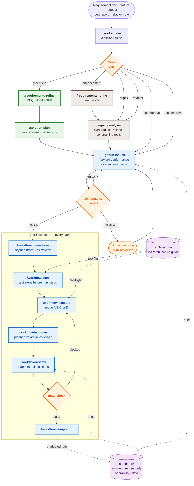
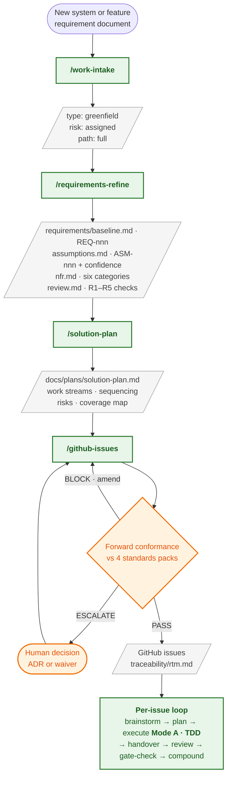
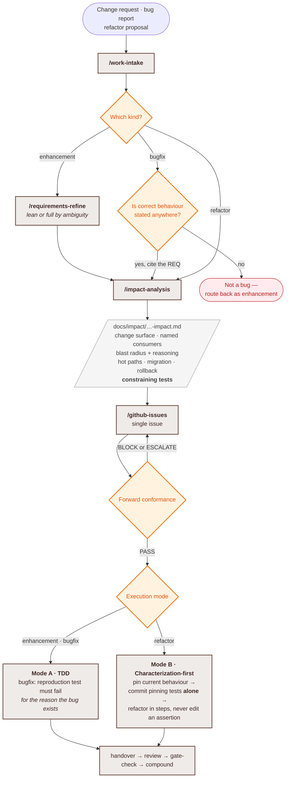
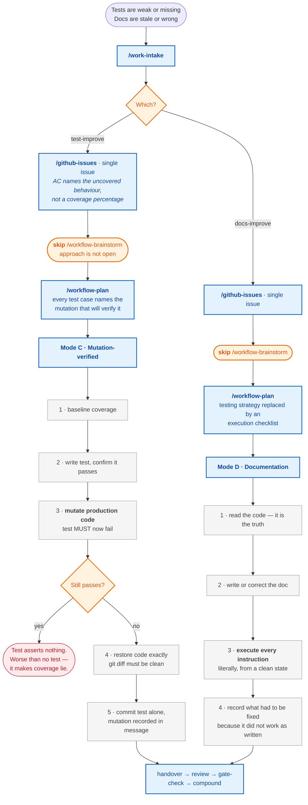
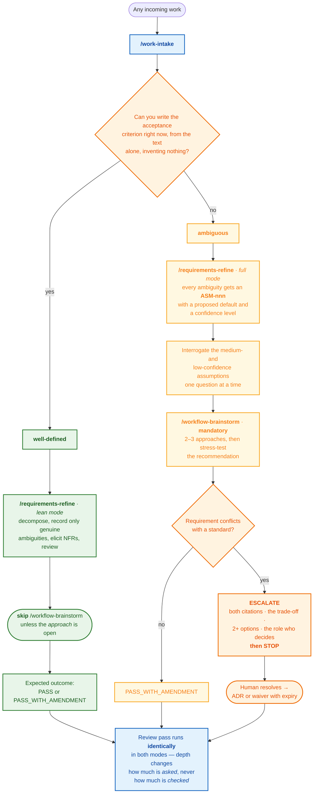
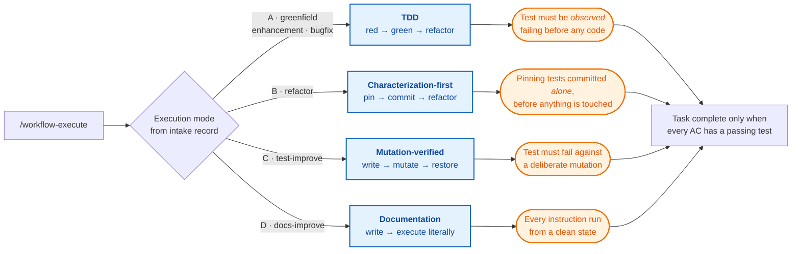
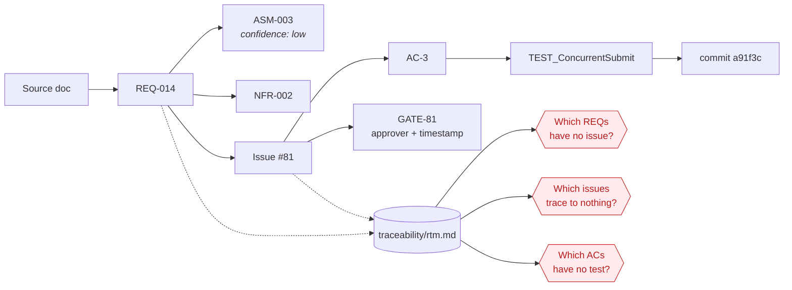

# Execution paths

How work moves through this system, from arrival to closure.

`/work-intake` is the only front door. It classifies incoming work on two independent axes — **work type** and **ambiguity** — and selects one of six paths. Applying maximum rigor to every piece of work is not rigor, it is ceremony: a one-line bug fix routed through full requirements engineering produces artifacts nobody reads and buries the judgment that actually mattered.

Every path converges on the same per-issue loop, and every path passes the same conformance and gate checks. Depth changes how much is **asked**; it never changes how much is **checked**.

---

## 1. Master routing

Three things this encodes deliberately:

- **Both paths converge at `/github-issues`, not before.** Greenfield goes through solution planning because it has work streams to sequence; brownfield skips it because a single-issue change does not. Conformance is checked once, on the same gate, for both — a bug fix cannot take the short route past the standards packs.
- **`BLOCK` and `ESCALATE` loop backward.** An issue that fails conformance is never created. That is the difference between validation and a warning label.
- **`/gate-check` failure returns to `/workflow-execute`, not to review.** A blocked gate means work remains, not that the review needs redoing.

---

## 2. Greenfield — new systems and features

---

## 3. Brownfield — enhancements, refactors, bug fixes

The bugfix branch has a stop in it. If nothing states the correct behaviour, this is not a bug — it is an enhancement wearing a bug's clothing, and it routes back. That distinction is the one most often blurred, and blurring it is how requirements rot: the second kind never gets written back into the baseline.

---

## 4. Test and documentation improvements

Neither of these can use red-green-refactor. You cannot write a failing test *for a test*, and a documentation change has no red step at all. Mode C inverts the verification — prove the test would catch the bug it claims to catch. Mode D replaces it — a doc that has not been executed is a doc that is wrong.

---

## 5. Well-defined vs ambiguous — the depth dial

Ambiguity is a second, independent axis. It does not choose a path; it changes how much interrogation the chosen path gets.

The last node is the point. The five review checks in `/requirements-refine` run identically in both modes. Otherwise "well-defined" becomes a way to skip rigor rather than a way to skip ceremony.

---

## 6. Execution modes

---

## 7. The traceability spine

Every artifact links back to a requirement clause. `traceability/rtm.md` is regenerated, never hand-maintained, and exists to answer the three questions at the bottom.

A non-zero answer to any of the three is a finding, not a footnote.

---

## Related

- [`architecture/README.md`](../architecture/README.md) — the system's structure, as opposed to this document's process
- [`standards/`](../standards/) — the rule packs the conformance check and review agents cite
- [`governance/architecture-docs-edit-gate.md`](../governance/architecture-docs-edit-gate.md) — why `architecture/` is gated and this document is not
